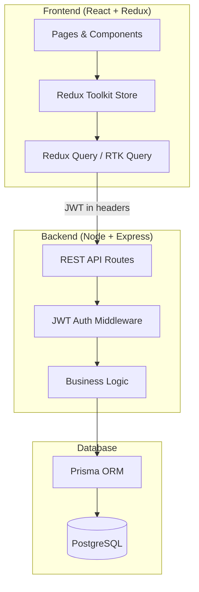
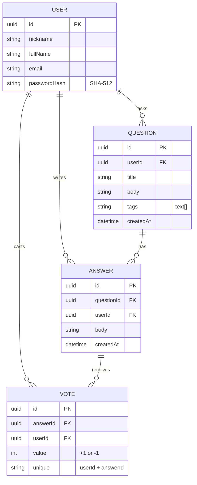
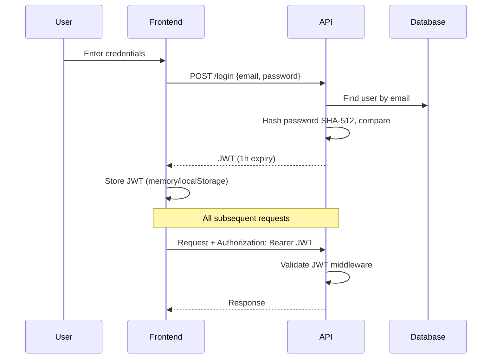
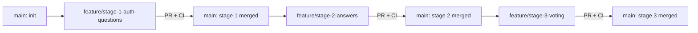

# IVOverflow — Architecture

> **Status:** Approved — architectural decisions finalized  
> **Last updated:** 2026-07-12

## Overview

IVOverflow is a developer Q&A platform (Stack Overflow–style) where IVTech developers ask questions with code snippets, receive answers, and vote on answer quality. The system is built in three stages: authentication & questions → answers → voting.

## Tech Stack

| Layer     | Technology                                         |
| --------- | -------------------------------------------------- |
| Frontend  | ReactJS, Redux Toolkit, RTK Query                  |
| Backend   | Node.js, Express, TypeScript                       |
| ORM       | **Prisma**                                         |
| Database  | **PostgreSQL**                                     |
| Auth      | JWT (1-hour expiration, required on all API calls) |
| Structure | **Monorepo** — `client/` + `server/`               |

## System Architecture



## API Endpoints (recommended by assignment)

| Method | Endpoint             | Auth | Purpose                                                       |
| ------ | -------------------- | ---- | ------------------------------------------------------------- |
| POST   | `/login`             | No   | Authenticate user, return JWT                                 |
| GET    | `/userInfo`          | Yes  | Validate JWT, return user profile                             |
| GET    | `/getQuestions`      | Yes  | List questions (with tags, author)                            |
| POST   | `/createQuestion`    | Yes  | Create new question with tags                                 |
| GET    | `/getQuestionAnswer` | Yes  | Get single question + answers **sorted by vote score (desc)** |
| POST   | `/answer`            | Yes  | Submit answer to a question                                   |
| POST   | `/vote`              | Yes  | Upvote/downvote an answer                                     |
| GET    | `/getVotes`          | Yes  | Get vote counts for answers                                   |

## Data Model



### Prisma Schema Highlights

- **Vote uniqueness:** `@@unique([userId, answerId])` — one vote per user per answer; re-voting updates the existing row
- **Tags:** stored as `String[]` on the `Question` model (PostgreSQL array column)
- **Vote score:** computed at query time as `SUM(vote.value)` per answer; not stored as a denormalized column

## Authentication Flow



## Frontend Pages

| Page            | Route               | Stage | Description                  |
| --------------- | ------------------- | ----- | ---------------------------- |
| Login           | `/login`            | 1     | Email/password form          |
| Questions List  | `/` or `/questions` | 1     | Browse all questions         |
| Ask Question    | `/ask`              | 1     | Form: title, body, tags      |
| Question Detail | `/questions/:id`    | 1–3   | Question + answers + vote UI |

## Git Flow



| Branch                           | Scope                                                                               |
| -------------------------------- | ----------------------------------------------------------------------------------- |
| `main`                           | Stable baseline; all feature branches merge here via PR                             |
| `feature/stage-1-auth-questions` | Monorepo, Docker Postgres, Prisma + seed, Express JWT auth, React login & questions |
| `feature/stage-2-answers`        | Answer model, backend endpoints, question detail page (view/add answers)            |
| `feature/stage-3-voting`         | Vote model + unique constraint, server-side score sorting, voting arrows UI         |

**Rules:** One feature branch per stage. PR required before merge. CI must pass on every push/PR.

## CI Pipeline

`.github/workflows/ci.yml` runs on **push** and **pull_request** to `main` and `feature/*` branches.

| Job      | Steps                                                                 |
| -------- | --------------------------------------------------------------------- |
| `server` | `npm ci` → `prisma generate` → `lint` → `test` → `build` in `server/` |
| `client` | `npm ci` → `npm run lint` → `npm run build` in `client/`              |

CI validates code integrity at each stage without requiring a running database (Prisma `generate` only; no `migrate` in CI). Stage 1 API tests mock Prisma so they run offline in CI.

## Testing (Server)

| Tool         | Role                                                |
| ------------ | --------------------------------------------------- |
| Vitest       | Test runner (`npm test` in `server/`)               |
| Supertest    | HTTP assertions against Express app                 |
| Prisma mocks | `vi.mock` in `tests/setup.ts` — no live DB required |

Test files: `server/tests/auth.test.ts`, `server/tests/questions.test.ts`, `server/tests/health.test.ts`

## Pre-commit Hooks

Husky + lint-staged at the monorepo root run **before every commit**, only on staged files:

| Staged files              | Actions                             |
| ------------------------- | ----------------------------------- |
| `server/**/*.{ts,js}`     | ESLint `--fix` → Prettier `--write` |
| `client/**/*.{ts,tsx,js}` | ESLint `--fix` → Prettier `--write` |
| `**/*.{json,md,yml,yaml}` | Prettier `--write`                  |

```bash
# Root install (triggers husky via prepare script)
npm install

# Hook lives at .husky/pre-commit → npx lint-staged
```

## Local Development

| Service     | How it runs                           |
| ----------- | ------------------------------------- |
| PostgreSQL  | Docker Compose (`postgres:16-alpine`) |
| Express API | Locally — `npm run dev` in `server/`  |
| React app   | Locally — `npm run dev` in `client/`  |

```bash
docker compose up -d          # start Postgres
cd server && npx prisma migrate dev && npx prisma db seed
cd server && npm run dev      # http://localhost:3001
cd client && npm run dev      # http://localhost:5173
```

## Project Structure (Monorepo)

```
IVOverflow/
├── .github/
│   └── workflows/
│       └── ci.yml              # GitHub Actions: lint + build (client + server)
├── client/                     # React frontend (runs locally)
│   ├── src/
│   │   ├── components/
│   │   ├── pages/
│   │   ├── store/              # Redux Toolkit + RTK Query
│   │   └── App.tsx
│   └── package.json
├── server/                     # Express backend (runs locally)
│   ├── prisma/
│   │   ├── schema.prisma       # PostgreSQL schema
│   │   ├── seed.ts             # Hardcoded users (SHA-512 passwords)
│   │   └── migrations/
│   ├── src/
│   │   ├── routes/
│   │   ├── middleware/         # JWT auth
│   │   └── index.ts
│   ├── .env.example
│   └── package.json
├── docker-compose.yml          # PostgreSQL only (postgres:16-alpine)
├── architecture.md
├── todo.md
├── AGENT.md
└── .cursorrules
```

## Answer Sorting & Voting Rules

### Server-side answer ordering

`GET /getQuestionAnswer` returns answers **sorted by vote score descending** (highest first). The server computes score per answer and applies `ORDER BY score DESC, createdAt ASC` as a tiebreaker.

```sql
-- Conceptual query shape
SELECT answer.*, COALESCE(SUM(vote.value), 0) AS score
FROM answers
LEFT JOIN votes ON votes.answer_id = answers.id
WHERE answers.question_id = $1
GROUP BY answers.id
ORDER BY score DESC, answers.created_at ASC
```

The frontend does **not** re-sort answers — ordering is guaranteed by the API.

### Vote constraint

- One vote per user per answer, enforced by Prisma `@@unique([userId, answerId])`
- `POST /vote` upserts: if the user already voted, update `value` (+1 or -1); otherwise insert
- Changing from upvote to downvote (or vice versa) updates the existing vote row

## Decisions Made

- [x] **Database:** PostgreSQL
- [x] **ORM:** Prisma
- [x] **Structure:** Monorepo (`client/` + `server/`)
- [x] **Git Flow:** Feature branches per stage, PR + CI before merge
- [x] **CI:** GitHub Actions — lint + build on push/PR
- [x] **Vote constraint:** `@@unique([userId, answerId])` — one vote per user per answer
- [x] **Answer ordering:** Server returns answers sorted by vote score (desc)

## Open Decisions

- [ ] JWT storage: localStorage vs httpOnly cookie
- [ ] Code snippet rendering library (e.g., Prism, highlight.js)

## Security Notes

- Passwords stored as SHA-512 hashes (per assignment spec)
- JWT required on all authenticated endpoints
- JWT expiration: 1 hour
- Prisma parameterized queries prevent SQL injection
- Vote uniqueness enforced at database level (unique constraint), not only in application logic
