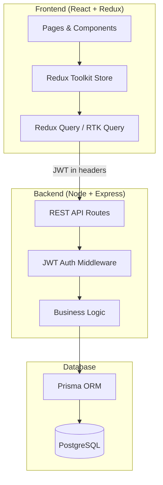
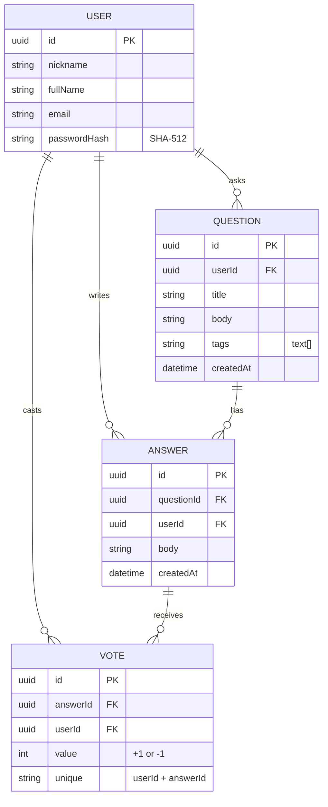
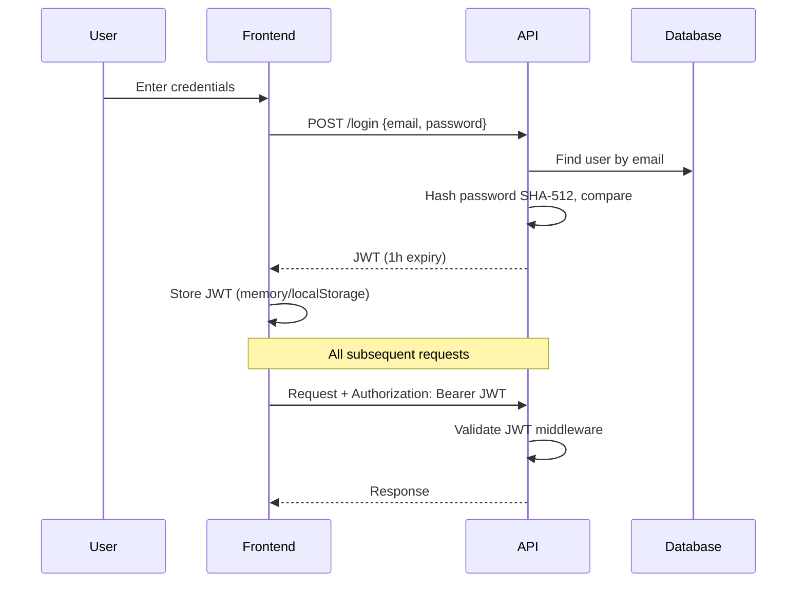
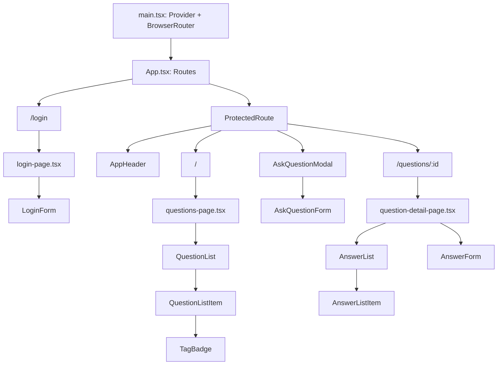
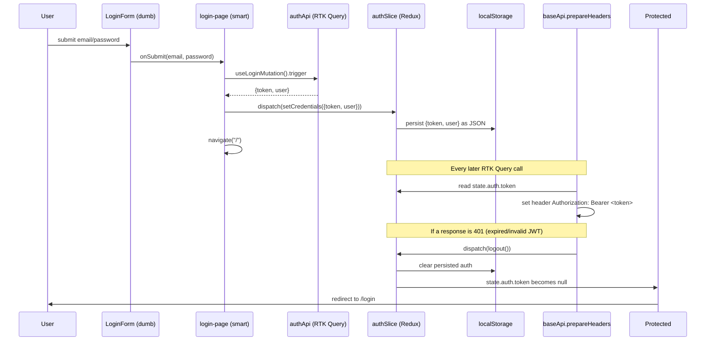
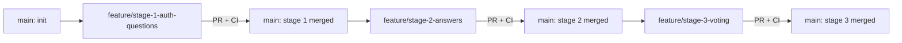

# IVOverflow — Architecture

> **Status:** Approved — architectural decisions finalized  
> **Last updated:** 2026-07-13

## Overview

IVOverflow is a developer Q&A platform (Stack Overflow–style) where IVTech developers ask questions with code snippets, receive answers, and vote on answer quality. The system is built in three stages: authentication & questions → answers → voting.

## Tech Stack

| Layer     | Technology                                         |
| --------- | -------------------------------------------------- |
| Frontend  | ReactJS, Redux Toolkit, RTK Query                  |
| Backend   | Node.js, Express, TypeScript                       |
| ORM       | **Prisma**                                         |
| Database  | **PostgreSQL**                                     |
| Auth      | JWT (1-hour expiration, required on all API calls) |
| Structure | **Monorepo** — `client/` + `server/`               |

## System Architecture



## API Endpoints (recommended by assignment)

| Method | Endpoint             | Auth | Purpose                                                       |
| ------ | -------------------- | ---- | ------------------------------------------------------------- |
| POST   | `/login`             | No   | Authenticate user, return JWT                                 |
| GET    | `/userInfo`          | Yes  | Validate JWT, return user profile                             |
| GET    | `/getQuestions`      | Yes  | List questions (with tags, author)                            |
| POST   | `/createQuestion`    | Yes  | Create new question with tags                                 |
| GET    | `/getQuestionAnswer` | Yes  | Get single question + answers **sorted by vote score (desc)** |
| POST   | `/answer`            | Yes  | Submit answer to a question                                   |
| POST   | `/vote`              | Yes  | Upvote/downvote an answer                                     |
| GET    | `/getVotes`          | Yes  | Get vote counts for answers                                   |

## Data Model



### Prisma Schema Highlights

- **Vote uniqueness:** `@@unique([userId, answerId])` — one vote per user per answer; re-voting updates the existing row
- **Tags:** stored as `String[]` on the `Question` model (PostgreSQL array column)
- **Vote score:** computed at query time as `SUM(vote.value)` per answer; not stored as a denormalized column

## Authentication Flow



## Frontend Pages

| Page            | Route            | Stage | Description                                                 |
| --------------- | ---------------- | ----- | ----------------------------------------------------------- |
| Login           | `/login`         | 1     | Email/password form                                         |
| Questions List  | `/`              | 1     | Browse all questions                                        |
| Ask Question    | _modal on `/`_   | 1     | Overlay form: title, body, tags — not a standalone route    |
| Question Detail | `/questions/:id` | 1–2   | Question + answers list + answer form; voting UI in Stage 3 |

## Frontend Architecture

> Scope: Stages 1–2 (auth, questions, answers). Voting UI (Stage 3) plugs into the same structure without refactoring.

### Folder Structure (`client/src`)

CSS Modules are co-located with their component (`Component.tsx` + `Component.module.css`), omitted below for brevity.

```
client/src/
├── main.tsx                    # ReactDOM root, wraps <App/> in <Provider store>
├── App.tsx                     # <BrowserRouter> + <Routes>
├── app/
│   ├── store.ts                # configureStore; preloads auth state from localStorage
│   └── hooks.ts                 # typed useAppDispatch / useAppSelector
├── api/                          # RTK Query layer (the only place that calls fetch)
│   ├── baseApi.ts                # createApi base: baseUrl "/api", prepareHeaders (JWT), 401 handling
│   ├── authApi.ts                # injectEndpoints: login, userInfo
│   ├── questionsApi.ts           # injectEndpoints: getQuestions, createQuestion, getQuestionAnswer
│   └── answersApi.ts             # injectEndpoints: createAnswer (invalidates Question by id)
├── features/
│   └── auth/
│       └── authSlice.ts          # { token, user } + setCredentials/logout, syncs to localStorage
├── components/
│   ├── ui/                       # generic, store-agnostic primitives
│   │   ├── Button.tsx
│   │   ├── TextField.tsx
│   │   ├── TextArea.tsx
│   │   └── Modal.tsx
│   ├── layout/
│   │   ├── AppHeader.tsx         # logo, search (visual only), Ask question, logout
│   │   └── ProtectedRoute.tsx    # redirects to /login if not authenticated; owns Ask Question modal
│   ├── auth/
│   │   └── LoginForm.tsx
│   ├── questions/
│   │   ├── QuestionList.tsx
│   │   ├── QuestionListItem.tsx
│   │   ├── TagBadge.tsx
│   │   ├── AskQuestionModal.tsx
│   │   └── AskQuestionForm.tsx
│   └── answers/
│       ├── AnswerList.tsx
│       ├── AnswerListItem.tsx
│       └── AnswerForm.tsx
├── pages/                        # kebab-case files (route-level), one per route
│   ├── login-page.tsx
│   ├── questions-page.tsx
│   └── question-detail-page.tsx  # question + answers list + answer form
├── types/                        # shared contracts with the backend (see below)
│   ├── user.ts
│   ├── question.ts
│   ├── answer.ts                 # Answer + CreateAnswerRequest/Response
│   ├── auth.ts
│   └── api.ts                    # ApiSuccess<T> / ApiError envelope
└── utils/
    ├── format-date.ts            # "asked <date>" / "answered <date>" formatting
    └── get-error-message.ts      # extract `{ error }` from RTK Query failures
```

**Notes**

- `api/` uses RTK Query exclusively — no component calls `fetch`/`axios` directly.
- `features/auth/authSlice.ts` is the **only** plain Redux slice (RTK Query owns questions/answers cache).
- Naming follows `.cursorrules`: `kebab-case` for `pages/`, `PascalCase` for components in `components/`.
- `createAnswer` invalidates `{ type: "Question", id: questionId }` so the active `getQuestionAnswer` query refetches — no full page reload.

### TypeScript Interfaces (Backend ↔ Frontend Contract)

These mirror the exact JSON shapes returned by the Express routes so the two sides can't drift silently.

```typescript
// types/api.ts — matches .cursorrules response envelope
export interface ApiSuccess<T> {
  data: T;
}
export interface ApiError {
  error: string;
}

// types/user.ts
export interface User {
  id: string;
  nickname: string;
  fullName: string;
  email: string;
}

// Lightweight author shape embedded in Question/Answer (no email exposed)
export interface Author {
  id: string;
  nickname: string;
  fullName: string;
}

// types/question.ts
export interface Question {
  id: string;
  userId: string;
  title: string;
  body: string;
  tags: string[];
  createdAt: string; // ISO date string
  user: Author;
}

// types/answer.ts
export interface Answer {
  id: string;
  questionId: string;
  userId: string;
  body: string;
  createdAt: string;
  user: Author;
}
export interface CreateAnswerRequest {
  questionId: string;
  body: string;
}
export interface CreateAnswerResponse {
  answer: Answer;
}

// types/auth.ts
export interface LoginRequest {
  email: string;
  password: string;
}
export interface LoginResponseData {
  token: string;
  user: User;
}

// Per-endpoint response payloads (wrapped in ApiSuccess<T> by the server)
export interface GetQuestionsResponse {
  questions: Question[];
}
export interface CreateQuestionResponse {
  question: Question;
}
export interface GetQuestionAnswerResponse {
  question: Question;
  answers: Answer[];
}
```

RTK Query endpoints use `transformResponse: (res: ApiSuccess<T>) => res.data` so hooks (`useGetQuestionsQuery`, etc.) resolve directly to `GetQuestionsResponse`, not the envelope. Non-2xx responses (`{ error: string }`) surface as `error.data.error` on the RTK Query error object.

### Component Breakdown & State Flow

| Component                                     | Type  | Responsibility                                                                                                            |
| --------------------------------------------- | ----- | ------------------------------------------------------------------------------------------------------------------------- |
| `App.tsx`                                     | Smart | Router only; renders `/login` and `ProtectedRoute`-wrapped app routes                                                     |
| `ProtectedRoute`                              | Smart | Reads `state.auth.token`; redirects to `/login` if absent; owns Ask Question modal + `createQuestion`                     |
| `AppHeader`                                   | Smart | Reads current user; dispatches `logout()`; opens Ask Question modal                                                       |
| `login-page.tsx`                              | Smart | Calls `useLoginMutation`; on success dispatches `setCredentials`, navigates `/`                                           |
| `LoginForm`                                   | Dumb  | Controlled email/password inputs; `onSubmit(email, password)`; shows passed-in error/loading                              |
| `questions-page.tsx`                          | Smart | Calls `useGetQuestionsQuery`; renders `QuestionList`                                                                      |
| `QuestionList`                                | Dumb  | Maps `Question[]` → `QuestionListItem`                                                                                    |
| `QuestionListItem`                            | Dumb  | Renders title/body excerpt/tags/author/date; `<Link>` to detail page. **No vote/answer counts** (Stage 3+)                |
| `TagBadge`                                    | Dumb  | Single tag pill                                                                                                           |
| `AskQuestionModal`                            | Dumb  | Wraps `Modal` + `AskQuestionForm`; `open`/`onClose` props                                                                 |
| `AskQuestionForm`                             | Dumb  | Title/body/tags(comma-separated) inputs; `onSubmit(payload)`                                                              |
| `question-detail-page.tsx`                    | Smart | `useGetQuestionAnswerQuery` + `useCreateAnswerMutation`; owns `formKey` / submit error; wires `AnswerList` + `AnswerForm` |
| `AnswerList`                                  | Dumb  | Renders `Answer[]` or empty state                                                                                         |
| `AnswerListItem`                              | Dumb  | Answer body + author/timestamp (**no vote UI** until Stage 3)                                                             |
| `AnswerForm`                                  | Dumb  | Body textarea; `onSubmit({ body })`; shows passed-in error/loading; remounted via `key={formKey}` after success           |
| `Button` / `TextField` / `TextArea` / `Modal` | Dumb  | Store-agnostic UI primitives, fully prop-driven                                                                           |



**Token flow (login → authenticated request → expiry):**



- `authSlice` initial state is built from `localStorage` synchronously in `store.ts`, so a page refresh keeps the user logged in until the JWT actually expires or a request 401s.
- No separate "rehydrate" API call is made on boot — the existing `getQuestions`/`getQuestionAnswer` calls double as the validity check, and a 401 on any of them triggers `logout()`.

## Git Flow



| Branch                           | Scope                                                                               |
| -------------------------------- | ----------------------------------------------------------------------------------- |
| `main`                           | Stable baseline; all feature branches merge here via PR                             |
| `feature/stage-1-auth-questions` | Monorepo, Docker Postgres, Prisma + seed, Express JWT auth, React login & questions |
| `feature/stage-2-answers`        | Answer model, backend endpoints, question detail page (view/add answers)            |
| `feature/stage-3-voting`         | Vote model + unique constraint, server-side score sorting, voting arrows UI         |

**Rules:** One feature branch per stage. PR required before merge. CI must pass on every push/PR.

## CI Pipeline

`.github/workflows/ci.yml` runs on **push** and **pull_request** to `main` and `feature/*` branches.

| Job      | Steps                                                                 |
| -------- | --------------------------------------------------------------------- |
| `server` | `npm ci` → `prisma generate` → `lint` → `test` → `build` in `server/` |
| `client` | `npm ci` → `npm run lint` → `npm run build` in `client/`              |

CI validates code integrity at each stage without requiring a running database (Prisma `generate` only; no `migrate` in CI). Stage 1 API tests mock Prisma so they run offline in CI.

## Testing (Server)

| Tool         | Role                                                |
| ------------ | --------------------------------------------------- |
| Vitest       | Test runner (`npm test` in `server/`)               |
| Supertest    | HTTP assertions against Express app                 |
| Prisma mocks | `vi.mock` in `tests/setup.ts` — no live DB required |

Test files: `server/tests/auth.test.ts`, `server/tests/questions.test.ts`, `server/tests/health.test.ts`

## Pre-commit Hooks

Husky + lint-staged at the monorepo root run **before every commit**, only on staged files:

| Staged files              | Actions                             |
| ------------------------- | ----------------------------------- |
| `server/**/*.{ts,js}`     | ESLint `--fix` → Prettier `--write` |
| `client/**/*.{ts,tsx,js}` | ESLint `--fix` → Prettier `--write` |
| `**/*.{json,md,yml,yaml}` | Prettier `--write`                  |

```bash
# Root install (triggers husky via prepare script)
npm install

# Hook lives at .husky/pre-commit → npx lint-staged
```

## Local Development

| Service     | How it runs                           |
| ----------- | ------------------------------------- |
| PostgreSQL  | Docker Compose (`postgres:16-alpine`) |
| Express API | Locally — `npm run dev` in `server/`  |
| React app   | Locally — `npm run dev` in `client/`  |

```bash
docker compose up -d          # start Postgres
cd server && npx prisma migrate dev && npx prisma db seed
cd server && npm run dev      # http://localhost:3001
cd client && npm run dev      # http://localhost:5173
```

## Project Structure (Monorepo)

```
IVOverflow/
├── .github/
│   └── workflows/
│       └── ci.yml              # GitHub Actions: lint + build (client + server)
├── client/                     # React frontend (runs locally)
│   ├── src/
│   │   ├── components/
│   │   ├── pages/
│   │   ├── store/              # Redux Toolkit + RTK Query
│   │   └── App.tsx
│   └── package.json
├── server/                     # Express backend (runs locally)
│   ├── prisma/
│   │   ├── schema.prisma       # PostgreSQL schema
│   │   ├── seed.ts             # Hardcoded users (SHA-512 passwords)
│   │   └── migrations/
│   ├── src/
│   │   ├── routes/
│   │   ├── middleware/         # JWT auth
│   │   └── index.ts
│   ├── .env.example
│   └── package.json
├── docker-compose.yml          # PostgreSQL only (postgres:16-alpine)
├── architecture.md
├── todo.md
├── AGENT.md
└── .cursorrules
```

## Answer Sorting & Voting Rules

### Server-side answer ordering

`GET /getQuestionAnswer` returns answers **sorted by vote score descending** (highest first). The server computes score per answer and applies `ORDER BY score DESC, createdAt ASC` as a tiebreaker.

```sql
-- Conceptual query shape
SELECT answer.*, COALESCE(SUM(vote.value), 0) AS score
FROM answers
LEFT JOIN votes ON votes.answer_id = answers.id
WHERE answers.question_id = $1
GROUP BY answers.id
ORDER BY score DESC, answers.created_at ASC
```

The frontend does **not** re-sort answers — ordering is guaranteed by the API.

### Vote constraint

- One vote per user per answer, enforced by Prisma `@@unique([userId, answerId])`
- `POST /vote` upserts: if the user already voted, update `value` (+1 or -1); otherwise insert
- Changing from upvote to downvote (or vice versa) updates the existing vote row

## Decisions Made

- [x] **Database:** PostgreSQL
- [x] **ORM:** Prisma
- [x] **Structure:** Monorepo (`client/` + `server/`)
- [x] **Git Flow:** Feature branches per stage, PR + CI before merge
- [x] **CI:** GitHub Actions — lint + build on push/PR
- [x] **Vote constraint:** `@@unique([userId, answerId])` — one vote per user per answer
- [x] **Answer ordering:** Server returns answers sorted by vote score (desc)
- [x] **JWT storage:** `localStorage` — backend returns the token in the JSON body (no `Set-Cookie`), so the client must persist it itself; `localStorage` keeps the session alive across refreshes with no refresh-token endpoint to otherwise restore it
- [x] **Frontend styling:** CSS Modules (`*.module.css`) co-located per component — zero extra dependencies, scoped class names, matches the plain wireframe aesthetic
- [x] **Syntax highlighting:** **Prism.js** — deferred to Polish & Extras; Stages 1–3 keep plain textareas / unhighlighted `<pre>` for question and answer bodies

## Open Decisions

_None — all architectural choices for Stages 1–3 are locked. Remaining polish items live under Polish & Extras in `todo.md`._

## Stage 2 Backend Blueprint (Answers)

> Design only — implementation starts after approval. Schema and `GET /getQuestionAnswer` already ship Answer support from Stage 1; Stage 2 adds `POST /answer` and wires the detail UI.

### Prisma relations (already in `schema.prisma`)

```text
User 1 ──* Question   (User.questions / Question.user)
User 1 ──* Answer     (User.answers / Answer.user)
Question 1 ──* Answer (Question.answers / Answer.question)
Answer 1 ──* Vote     (present; unused until Stage 3)
```

| Model      | FK fields                                          | Relation fields                                            |
| ---------- | -------------------------------------------------- | ---------------------------------------------------------- |
| `User`     | —                                                  | `questions Question[]`, `answers Answer[]`, `votes Vote[]` |
| `Question` | `userId` → `User.id`                               | `user User`, `answers Answer[]`                            |
| `Answer`   | `questionId` → `Question.id`, `userId` → `User.id` | `question Question`, `user User`, `votes Vote[]`           |

`Answer` columns: `id` (uuid PK), `questionId`, `userId`, `body` (text), `createdAt` (default now). Tables mapped to `snake_case` (`answers`, `question_id`, etc.).

### Migration step

- **No new Prisma migration required** for Stage 2 — `Answer` (and `Vote`) were created in the Stage 1 init migration (`20260712183751_init`).
- Local verify before coding endpoints: `docker compose up -d` → `npx prisma migrate status` (should report applied) → optional `npx prisma db seed` if the DB was wiped.
- If a fresh environment lacks the init migration applied, run `npx prisma migrate dev` once; do **not** invent a second Answer-only migration.

### `POST /answer` contract

| Item           | Spec                                                                                                                              |
| -------------- | --------------------------------------------------------------------------------------------------------------------------------- |
| Method/path    | `POST /answer`                                                                                                                    |
| Auth           | Required — JWT Bearer (`authMiddleware`); author = `req.userId`                                                                   |
| Request body   | `{ "questionId": string, "body": string }`                                                                                        |
| Success        | `201 Created` → `{ data: { answer: Answer } }`                                                                                    |
| `Answer` shape | Same as `types/answer.ts`: `id`, `questionId`, `userId`, `body`, `createdAt` (ISO), `user: Author` (`id`, `nickname`, `fullName`) |

**Validation / errors**

| Condition                            | Status | Body                                            |
| ------------------------------------ | ------ | ----------------------------------------------- |
| Missing/blank `questionId` or `body` | 400    | `{ error: "questionId and body are required" }` |
| Question id does not exist           | 404    | `{ error: "Question not found" }`               |
| Missing/invalid JWT                  | 401    | `{ error: ... }` (existing middleware)          |
| Unexpected failure                   | 500    | `{ error: string }`                             |

**Handler behavior (when implemented)**

1. Validate `questionId` + non-empty trimmed `body`.
2. Confirm question exists (`findUnique` / `findFirst`).
3. `prisma.answer.create` with `userId: req.userId`, include `user: { select: authorSelect }` (same author select as questions routes).
4. Return `201` with `{ data: { answer } }`.

### `GET /getQuestionAnswer` (Stage 2 expectation)

Already returns `{ data: { question, answers } }` with answers ordered by `createdAt asc` and each answer including `user` (Author). Stage 2 **does not** change this contract; Stage 3 will switch ordering to vote score desc.

## Security Notes

- Passwords stored as SHA-512 hashes (per assignment spec)
- JWT required on all authenticated endpoints
- JWT expiration: 1 hour
- Prisma parameterized queries prevent SQL injection
- Vote uniqueness enforced at database level (unique constraint), not only in application logic
